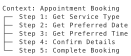

| | |
|--|--|
| **Duration** | 2.5 hours |
| **Day** | 4 of 5 |

## Learning Objectives

By the end of this module, students will be able to:

- Design multi-step conversational workflows
- Use ContextBuilder to create contexts
- Define steps with validation criteria
- Implement branching conversation paths

## Topics

### 1. What Are Contexts? (20 min)

#### The Problem

Single-prompt agents handle everything at once:

```text
Agent: "How can I help you today?"
Caller: "I want to book an appointment"
Agent: "What date? What time? What service? Your name? Phone number?"
        ^^ Too much at once!
```

#### The Solution: Contexts

Contexts create guided, multi-step conversations:



Each step focuses on ONE thing.

#### When to Use Contexts

| Use Contexts | Don't Use Contexts |
|--------------|-------------------|
| Multi-step forms | Simple Q&A |
| Data collection | General chat |
| Guided processes | Open-ended help |
| Conditional flows | Single-question tasks |

---

### 2. ContextBuilder Basics (35 min)

#### Creating a Context

```python
from signalwire_agents import AgentBase

class BookingAgent(AgentBase):
    def __init__(self):
        super().__init__(name="booking-agent")

        # Get the context builder
        contexts = self.define_contexts()

        # Create context (single context must be named "default")
        appointment = contexts.add_context("default")

        # Add steps with method chaining
        appointment.add_step("get_service") \
            .set_text("What service would you like to book today? "
                      "We offer haircuts, coloring, and styling.") \
            .set_step_criteria("Customer has selected a service") \
            .set_valid_steps(["get_date"])

        appointment.add_step("get_date") \
            .set_text("What date works best for you?") \
            .set_step_criteria("Customer has provided a date") \
            .set_valid_steps(["get_time"])

        appointment.add_step("get_time") \
            .set_text("What time would you prefer?") \
            .set_step_criteria("Customer has provided a time")
```

#### Step Components

```python
context.add_step("step_name") \           # Create step with unique name
    .set_text("Instructions...") \        # What AI says/asks
    .set_step_criteria("...") \           # When step is complete
    .set_valid_steps(["next_step"]) \     # Where to go next
    .set_functions(["func1", "func2"])    # Available functions
```

---

### 3. Step Criteria (30 min)

#### Defining Completion Criteria

Step criteria tell the AI when a step is complete:

```python
appointment.add_step("get_service") \
    .set_text("What service would you like?") \
    .set_step_criteria("Customer has selected haircut, coloring, or styling") \
    .set_valid_steps(["get_date"])
```

The AI checks these criteria after each user response.

#### Good Criteria Examples

Write specific, measurable criteria:

```python
appointment.add_step("get_phone") \
    .set_text("What's your callback number?") \
    .set_step_criteria("Customer has provided a valid phone number") \
    .set_valid_steps(["confirm"])
```

#### Criteria Guidelines

| Step | Good Criteria |
|------|---------------|
| Get name | "Customer has provided their full name" |
| Get date | "Customer has provided a valid future date" |
| Get rating | "Customer has given a rating between 1 and 5" |
| Confirm | "Customer has confirmed the details" |

**Tips:**

- Be specific and measurable
- Phrase as completion conditions
- Focus on what information has been collected

---

### 4. Step Transitions (25 min)

#### Sequential Flow

Control navigation with `set_valid_steps()`:

```python
context.add_step("step_1") \
    .set_text("First question") \
    .set_step_criteria("Answer provided") \
    .set_valid_steps(["step_2"])  # Go to step_2 next

context.add_step("step_2") \
    .set_text("Second question") \
    .set_step_criteria("Answer provided") \
    .set_valid_steps(["step_3"])  # Go to step_3 next

context.add_step("step_3") \
    .set_text("Final question") \
    .set_step_criteria("Process complete")  # Terminal step
```

#### Using "next" for Sequential Flow

```python
# Use "next" to go to the next step in order
context.add_step("get_date") \
    .set_text("What date works for you?") \
    .set_step_criteria("Customer provided a date") \
    .set_valid_steps(["next"])  # Advance to next defined step
```

#### Context-Level Fillers

Add transition phrases at the context level:

```python
context.add_enter_filler("en-US", [
    "Great, let's get started!",
    "Perfect, let me help you with that."
])

context.add_exit_filler("en-US", [
    "All done with this section.",
    "Moving on to the next step."
])
```

---

### 5. Branching Workflows (30 min)

#### Multi-Context Setup

Create multiple contexts for different branches:

```python
from signalwire_agents import AgentBase, SwaigFunctionResult


class SupportAgent(AgentBase):
    def __init__(self):
        super().__init__(name="support-agent")

        self.prompt_add_section("Role", "Route callers to appropriate support.")

        contexts = self.define_contexts()

        # Triage context
        triage = contexts.add_context("triage")
        triage.add_step("get_issue_type") \
            .set_text("Is this a billing issue or a technical issue?") \
            .set_step_criteria("Customer has specified issue type") \
            .set_valid_contexts(["billing", "technical"])

        # Billing context
        billing = contexts.add_context("billing") \
            .set_isolated(True) \
            .add_section("Role", "You are a billing specialist.")
        billing.add_step("assist") \
            .set_text("How can I help with your billing question?") \
            .set_step_criteria("Billing issue resolved")

        # Technical context
        technical = contexts.add_context("technical") \
            .set_isolated(True) \
            .add_section("Role", "You are a technical support specialist.")
        technical.add_step("assist") \
            .set_text("What technical issue are you experiencing?") \
            .set_step_criteria("Technical issue resolved")
```

#### Context Switching via Action

```python
result = SwaigFunctionResult("Let me transfer you to billing.")
result.swml_change_context("billing"
)
return result
```

---

### 6. Complete Example (20 min)

{::nomarkdown}
<details>
<summary>Click to reveal complete solution</summary>
{:/}

#### Appointment Booking Agent

```python
#!/usr/bin/env python3
"""Multi-step appointment booking agent."""

from signalwire_agents import AgentBase, SwaigFunctionResult


class AppointmentAgent(AgentBase):
    def __init__(self):
        super().__init__(name="appointment-agent")

        self.prompt_add_section(
            "Role",
            "You help customers book salon appointments. "
            "Guide them through the booking process step by step."
        )

        self.add_language("English", "en-US", "rime.spore")

        self._setup_booking_context()
        self._setup_functions()

    def _setup_booking_context(self):
        """Create the appointment booking workflow."""

        contexts = self.define_contexts()
        booking = contexts.add_context("default")

        # Add enter filler at context level
        booking.add_enter_filler("en-US", ["Let's get you booked!"])

        # Step 1: Service selection
        booking.add_step("select_service") \
            .set_text("What service would you like today? "
                      "We offer haircuts, coloring, styling, and treatments.") \
            .set_step_criteria("Customer has selected a service") \
            .set_valid_steps(["select_date"])

        # Step 2: Date selection
        booking.add_step("select_date") \
            .set_text("What date works best for you?") \
            .set_step_criteria("Customer has provided a future date") \
            .set_valid_steps(["select_time"])

        # Step 3: Time selection
        booking.add_step("select_time") \
            .set_text("What time would you prefer? "
                      "We have openings from 9 AM to 6 PM.") \
            .set_step_criteria("Customer has provided a time between 9 AM and 6 PM") \
            .set_valid_steps(["get_contact"])

        # Step 4: Contact info
        booking.add_step("get_contact") \
            .set_text("What phone number can we reach you at?") \
            .set_step_criteria("Customer has provided a phone number") \
            .set_valid_steps(["confirm"])

        # Step 5: Confirmation
        booking.add_step("confirm") \
            .set_text("Let me confirm your appointment details. Is everything correct?") \
            .set_step_criteria("Customer has confirmed the appointment") \
            .set_functions(["finalize_booking"])

    def _setup_functions(self):
        @self.tool(
            description="Complete the appointment booking",
            fillers=["Booking your appointment now..."]
        )
        def finalize_booking(
            service: str,
            date: str,
            time: str,
            phone: str
        ) -> SwaigFunctionResult:
            # In production, save to database
            return (
                SwaigFunctionResult(
                    f"Appointment confirmed for {service} on {date} at {time}. "
                    "You'll receive a confirmation text shortly."
                )
                .send_sms(
                    to_number=phone,
                    from_number="+15559876543",
                    body=f"Appointment confirmed: {service} on {date} at {time}"
                )
            )


if __name__ == "__main__":
    agent = AppointmentAgent()
    agent.run()
```

{::nomarkdown}
</details>
{:/}

---

## Best Practices

### 1. Keep Steps Focused

Each step should ask for ONE piece of information.

### 2. Provide Clear Prompts

Tell users exactly what you need:

```python
# Good
step.set_text("What date works for you? For example, 'next Tuesday' or 'January 15th'")

# Bad
step.set_text("When?")
```

### 3. Write Good Step Criteria

Be specific and measurable:

```python
# Good criteria
step.set_step_criteria("Customer has provided a valid future date")

# Bad criteria
step.set_step_criteria("Customer is ready")  # Too vague
```

### 4. Use Fillers Appropriately

Add fillers at the context level:

```python
context.add_enter_filler("en-US", [
    "Perfect, let's get started!",
    "Great, let me help you with that."
])
```

---

## Key Takeaways

1. **Contexts create structure** - Multi-step guided conversations
2. **Steps focus on one thing** - Don't overwhelm users
3. **Step criteria ensure quality** - Define clear completion conditions
4. **Branching enables flexibility** - Route based on answers
5. **Fillers smooth transitions** - Natural conversation flow

## Preparation for Lab 2.5

- Think of a multi-step process (3+ steps)
- Identify step criteria for each step
- Consider multi-context scenarios

## Lab Preview

In Lab 2.5, you will:

1. Build a multi-context workflow
2. Implement step criteria
3. Add context-level fillers
4. Handle context transitions
