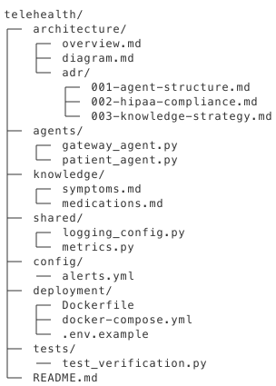

# Level 3 Practical Assessment

<p style="background: #e7f3fe; border-left: 4px solid #2196F3; padding: 15px; margin: 20px 0;">
<strong>🎯 Assignment:</strong> <a href="https://classroom.github.com/a/okkkzRb0" target="_blank"><strong>Accept this exam on GitHub Classroom</strong></a><br>
<small>You'll get your own repository. Submit your code and a recording (wav, mp3, or mp4) of your live demo.</small>
</p>

## Certified Voice AI Architect

| | |
|--|--|
| **Duration** | 4 hours |
| **Passing Score** | 70% (automated) + manual review |
| **Grading** | Automated checks + instructor review |

---

## Exam Overview

Design and implement a production-ready enterprise voice AI system demonstrating mastery of all architect-level concepts.

---

## Scenario: TeleHealth Connect

You are architecting a telehealth voice AI system that:

- Triages patient symptoms
- Schedules appointments with specialists
- Provides medication reminders
- Handles prescription refill requests
- Routes to on-call nurses for urgent issues

### Compliance Requirements

- HIPAA-compliant data handling
- No PHI in logs
- Recording consent required
- Identity verification before PHI access

---

## Part 1: Architecture Design (20 points)

### Deliverables

Create `architecture/` directory with:

**1. `overview.md`** - System overview including:

- High-level architecture description
- List of agents and responsibilities
- Integration points
- Data flow description

**2. `diagram.md`** - ASCII or described system diagram showing:

- Agent relationships
- Data flow
- External integrations
- Security boundaries

**3. `adr/001-agent-structure.md`** - ADR for agent organization
**4. `adr/002-hipaa-compliance.md`** - ADR for HIPAA approach
**5. `adr/003-knowledge-strategy.md`** - ADR for knowledge base design

### Evaluation Criteria

- [ ] Clear separation of concerns (4 points)
- [ ] Security boundaries defined (4 points)
- [ ] Scalability considered (4 points)
- [ ] ADRs explain rationale (4 points)
- [ ] Diagram accurate and complete (4 points)

---

## Part 2: Gateway Agent (15 points)

### Requirements

Create `agents/gateway_agent.py`:

- Route to appropriate department
- Handle after-hours routing
- Provide general information
- Implement health check

### Required Functions

1. `route_call(department)` - Route to specialist
2. `get_hours()` - Return operating hours
3. `emergency_guidance()` - Provide emergency info

### Evaluation Criteria

- [ ] Clean routing logic (5 points)
- [ ] After-hours handling (3 points)
- [ ] Emergency handling (3 points)
- [ ] Health endpoint (2 points)
- [ ] Proper authentication (2 points)

---

## Part 3: Patient Services Agent (25 points)

### Requirements

Create `agents/patient_agent.py`:

- Multi-step patient verification
- Symptom triage workflow (contexts)
- Appointment scheduling (DataMap)
- Prescription refills
- Secure data handling

### Required Contexts

1. **Verification** - Verify patient identity
2. **Triage** - Assess symptoms
3. **Scheduling** - Book appointments
4. **Prescriptions** - Handle refills

### Required Functions

**Verification:**

- `verify_patient(dob, member_id)` - Verify identity (secure)

**Triage:**

- `assess_symptoms(symptoms)` - Initial assessment
- `escalate_urgent()` - Route to nurse

**Scheduling:**

- `check_availability(specialty, date)` - DataMap to scheduling API
- `book_appointment(slot_id)` - Confirm booking

**Prescriptions:**

- `request_refill(medication, pharmacy)` - Submit refill request

### Evaluation Criteria

- [ ] Verification before PHI access (5 points)
- [ ] Context workflow correct (5 points)
- [ ] DataMap integration working (5 points)
- [ ] Recording paused for sensitive data (3 points)
- [ ] Proper error handling (3 points)
- [ ] Security logging (4 points)

---

## Part 4: Knowledge Integration (10 points)

### Requirements

Create knowledge base for:

- Common symptoms and guidance
- Medication information
- Provider directory
- FAQ

### Deliverables

1. `knowledge/symptoms.md` - Symptom guidance
2. `knowledge/medications.md` - Medication info
3. Knowledge integration in patient agent

### Evaluation Criteria

- [ ] Relevant content created (3 points)
- [ ] Search skill configured (3 points)
- [ ] Appropriate use in functions (2 points)
- [ ] Fallback for unknown queries (2 points)

---

## Part 5: Observability (15 points)

### Requirements

Create `shared/` directory with:

**1. `logging_config.py`** - Structured JSON logging

- Call ID correlation
- Function timing
- PHI exclusion

**2. `metrics.py`** - Prometheus metrics

- Call counters
- Function latency histograms
- Business metrics (appointments, refills)

**3. `config/alerts.yml`** - Alert rules

- Error rate alert
- Latency alert
- Business metric alerts

### Evaluation Criteria

- [ ] JSON structured logs (3 points)
- [ ] Correlation IDs (2 points)
- [ ] PHI excluded from logs (3 points)
- [ ] Relevant metrics defined (3 points)
- [ ] Appropriate alert thresholds (2 points)
- [ ] Health check comprehensive (2 points)

---

## Part 6: Deployment (10 points)

### Requirements

Create `deployment/` directory with:

**1. `Dockerfile`**

- Multi-stage build
- Non-root user
- Health check

**2. `docker-compose.yml`**

- All agents
- Environment configuration
- Health checks

**3. `.env.example`**

- All required variables
- Comments explaining each

### Evaluation Criteria

- [ ] Dockerfile follows best practices (3 points)
- [ ] Health checks configured (2 points)
- [ ] Environment properly managed (2 points)
- [ ] Compose orchestrates correctly (2 points)
- [ ] Documentation accurate (1 point)

---

## Part 7: Testing & Documentation (5 points)

### Requirements

**1. `tests/test_verification.py`** - Test patient verification

**2. `README.md`**

- Setup instructions
- Architecture overview
- API documentation

### Evaluation Criteria

- [ ] Tests cover critical paths (2 points)
- [ ] README complete (2 points)
- [ ] Setup instructions work (1 point)

---

## Submission Structure



---

## Grading Rubric

### Automated Checks (85 points)

These checks run automatically when you push your code:

| Criteria | Points | Type |
|----------|--------|------|
| Gateway agent loads without errors | 5 | Automated |
| Gateway generates valid SWML | 5 | Automated |
| route_call function exists | 5 | Automated |
| Patient agent loads without errors | 5 | Automated |
| Patient generates valid SWML | 5 | Automated |
| verify_patient function exists | 5 | Automated |
| assess_symptoms function exists | 5 | Automated |
| book_appointment function exists | 5 | Automated |
| Has secure function marking | 5 | Automated |
| Has multi-context workflow | 5 | Automated |
| Has recording control | 5 | Automated |
| route_call routes correctly | 5 | Automated |
| verify_patient validates identity | 5 | Automated |
| Has agent transfer capability | 5 | Automated |
| get_hours function exists | 5 | Automated |
| request_refill function exists | 5 | Automated |

### Manual Review (15 points)

After passing automated checks, an instructor will review:

| Criteria | Points |
|----------|--------|
| Architecture design (ADRs, diagrams) | 5 |
| Deployment configuration | 5 |
| Live demonstration recording | 5 |

---

## Testing Commands

```bash
# Test gateway agent
swaig-test agents/gateway_agent.py --dump-swml
swaig-test agents/gateway_agent.py --exec route_call --department "triage"

# Test patient agent
swaig-test agents/patient_agent.py --list-tools
swaig-test agents/patient_agent.py --exec verify_patient \
  --dob "1980-01-15" --member_id "M123456"

# Build Docker
docker build -t telehealth:latest -f deployment/Dockerfile .

# Run with compose
docker-compose -f deployment/docker-compose.yml up

# Check health
curl http://localhost:3000/health

# Check metrics
curl http://localhost:9090/metrics
```

---

## Time Management

| Phase | Suggested Time |
|-------|---------------|
| Architecture & Design | 45 min |
| Gateway Agent | 30 min |
| Patient Agent | 75 min |
| Knowledge Base | 30 min |
| Observability | 45 min |
| Deployment | 30 min |
| Testing & Docs | 15 min |
| Review & Polish | 30 min |

---

## Important Notes

1. **HIPAA Compliance**: All PHI handling must follow secure patterns
2. **Code Quality**: Clean, documented, production-ready code expected
3. **Testing**: Verify all functions work before submission
4. **Documentation**: Architecture decisions must be justified

---

## Submission Instructions

1. Place your gateway agent in `solution/gateway_agent.py`
2. Place your patient agent in `solution/patient_agent.py`
3. Create all architecture files in `architecture/` directory
4. Create deployment files in `deployment/` directory
5. Add your demo recording (wav, mp3, or mp4) to the repository
6. Push to trigger auto-grading
7. Check the "Grading Results" issue for automated feedback

**Note:** After automated checks pass, your submission will be tagged for manual review by an instructor.

Good luck! This exam demonstrates your readiness to architect enterprise voice AI systems.
