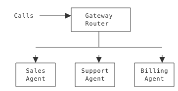
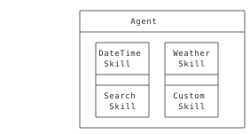
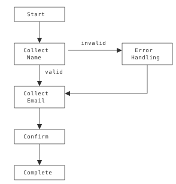
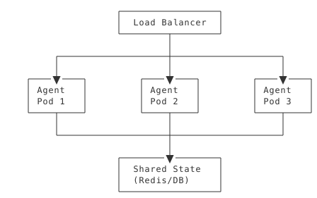

| | |
|--|--|
| **Duration** | 2.5 hours |
| **Day** | 6 of 7 |

## Learning Objectives

By the end of this module, students will be able to:

- Apply design patterns for voice AI systems
- Design scalable agent architectures
- Avoid common anti-patterns
- Document architectural decisions

## Topics

### 1. Voice AI Design Patterns (40 min)

#### Pattern 1: Gateway Router

Central entry point distributes to specialized agents:



**When to Use:**

- Multiple specialized agents
- Need call routing logic
- Want centralized entry point

**Implementation:**

```python
class GatewayAgent(AgentBase):
    def __init__(self):
        super().__init__(name="gateway", route="/")

    @AgentBase.tool(
        description="Route to department",
        parameters={
            "type": "object",
            "properties": {
                "department": {"type": "string", "description": "Department name"}
            },
            "required": ["department"]
        }
    )
    def route(self, args: dict, raw_data: dict = None) -> SwaigFunctionResult:
        department = args.get("department", "")
        return (
            SwaigFunctionResult(f"Connecting to {department}.")
            .connect(f"/agents/{department}", final=True)
        )
```

---

#### Pattern 2: Skill Composition

Build agents from reusable skill modules:



**When to Use:**

- Common functionality across agents
- Want maintainable, reusable code
- Team develops different capabilities

**Implementation:**

```python
class SupportAgent(AgentBase):
    def __init__(self):
        super().__init__(name="support")

        # Compose from skills
        self.add_skill("datetime")
        self.add_skill("web_search")
        self.add_skill("custom_kb", kb_path="/data/support.json")
```

---

#### Pattern 3: Context State Machine

Structured workflows as state transitions:



**When to Use:**

- Multi-step data collection
- Complex validation requirements
- Need to handle errors and retries

---

#### Pattern 4: DataMap Integration

Serverless external API integration:


**When to Use:**

- Simple REST API integration
- No custom logic needed
- Want to avoid webhook handlers

---

### 2. Scalability Patterns (30 min)

#### Horizontal Scaling



**Key Considerations:**

- Stateless agents (externalize state)
- Shared session storage
- Health checks for load balancer
- Auto-scaling policies

#### Stateless Agent Design

```python
class StatelessAgent(AgentBase):
    def __init__(self, redis_client):
        super().__init__(name="stateless")
        self.redis = redis_client

    @AgentBase.tool(
        description="Store customer data",
        parameters={
            "type": "object",
            "properties": {
                "call_id": {"type": "string", "description": "Call ID"},
                "data": {"type": "object", "description": "Data to store"}
            },
            "required": ["call_id", "data"]
        }
    )
    def store_data(self, args: dict, raw_data: dict = None) -> SwaigFunctionResult:
        call_id = args.get("call_id", "")
        data = args.get("data", {})
        # Store in Redis, not local memory
        self.redis.hset(f"call:{call_id}", mapping=data)
        return SwaigFunctionResult("Data stored.")

    @AgentBase.tool(
        description="Retrieve customer data",
        parameters={
            "type": "object",
            "properties": {
                "call_id": {"type": "string", "description": "Call ID"}
            },
            "required": ["call_id"]
        }
    )
    def get_data(self, args: dict, raw_data: dict = None) -> SwaigFunctionResult:
        call_id = args.get("call_id", "")
        data = self.redis.hgetall(f"call:{call_id}")
        return SwaigFunctionResult(str(data))
```

---

### 3. Anti-Patterns to Avoid (25 min)

#### Anti-Pattern 1: Monolithic Agent

**Problem:** One agent does everything

```python
# BAD: Giant agent with 50 functions
class EverythingAgent(AgentBase):
    def sales_function_1(self): ...
    def sales_function_2(self): ...
    def support_function_1(self): ...
    # ... 47 more functions
```

**Solution:** Split into focused agents

```python
# GOOD: Specialized agents
class SalesAgent(AgentBase): ...
class SupportAgent(AgentBase): ...
class BillingAgent(AgentBase): ...
```

---

#### Anti-Pattern 2: Hardcoded Configuration

**Problem:** Configuration embedded in code

```python
# BAD
agent.set_params({
    "swml_basic_auth_password": "mysecret123"  # In code!
})
```

**Solution:** Use environment variables

```python
# GOOD
agent.set_params({
    "swml_basic_auth_password": os.getenv("AUTH_PASSWORD")
})
```

---

#### Anti-Pattern 3: Synchronous External Calls

**Problem:** Blocking calls in functions

```python
# BAD: Blocks for 30 seconds
@agent.tool(
    description="Get data",
    parameters={
        "type": "object",
        "properties": {
            "id": {"type": "string", "description": "Data ID"}
        },
        "required": ["id"]
    }
)
def get_data(args: dict, raw_data: dict = None) -> SwaigFunctionResult:
    id = args.get("id", "")
    response = requests.get(f"https://slow-api.com/{id}")  # 30s timeout
    return SwaigFunctionResult(response.json())
```

**Solution:** Use timeouts and async patterns

```python
# GOOD: With timeout and error handling
@agent.tool(
    description="Get data",
    parameters={
        "type": "object",
        "properties": {
            "id": {"type": "string", "description": "Data ID"}
        },
        "required": ["id"]
    },
    fillers=["Looking that up...", "Still searching..."]
)
def get_data(args: dict, raw_data: dict = None) -> SwaigFunctionResult:
    id = args.get("id", "")
    try:
        response = requests.get(
            f"https://api.com/{id}",
            timeout=5  # 5 second max
        )
        return SwaigFunctionResult(response.json())
    except requests.Timeout:
        return SwaigFunctionResult(
            "I'm having trouble reaching that system. "
            "Can I help with something else?"
        )
```

---

#### Anti-Pattern 4: Exposing Internal Errors

**Problem:** Technical errors exposed to callers

```python
# BAD
except Exception as e:
    return SwaigFunctionResult(f"Error: {str(e)}")
    # Caller hears: "Error: ConnectionRefusedError: [Errno 111]..."
```

**Solution:** User-friendly error messages

```python
# GOOD
except Exception as e:
    logger.error(f"Function failed: {e}")
    return SwaigFunctionResult(
        "I'm having trouble with that right now. "
        "Would you like me to transfer you to someone who can help?"
    )
```

---

### 4. Documentation Practices (25 min)

#### Architecture Decision Records (ADRs)

Document why, not just what:

```markdown
# ADR 001: Multi-Agent vs Single Agent

## Status
Accepted

## Context
We need to support sales, support, and billing functions.

## Decision
Use separate agents for each department with a gateway router.

## Consequences
- Pros: Easier to maintain, team can work independently
- Cons: More complex deployment, need shared state solution
```

#### Agent Documentation Template

```markdown
# Sales Agent

## Purpose
Handle sales inquiries and pricing questions.

## Endpoints
- SWML: `/sales`
- SWAIG: `/sales/swaig`

## Functions
| Function | Description | Parameters |
|----------|-------------|------------|
| get_pricing | Get product pricing | product (string) |
| check_availability | Check product stock | sku (string) |

## Dependencies
- Product database
- Pricing API

## Configuration
| Variable | Description | Default |
|----------|-------------|---------|
| PRODUCT_API_URL | Product API endpoint | - |
| CACHE_TTL | Cache duration | 300 |
```

---

## Key Takeaways

1. **Patterns provide structure** - Use proven approaches
2. **Scale horizontally** - Design for multiple instances
3. **Avoid anti-patterns** - Learn from common mistakes
4. **Document decisions** - Future you will thank you
5. **Keep agents focused** - Single responsibility principle

## Preparation for Lab 3.1

- Review your Level 2 projects
- Identify architectural patterns used
- List potential improvements

## Lab Preview

In Lab 3.1, you will:

1. Design a multi-agent architecture
2. Document with ADRs
3. Identify and fix anti-patterns
4. Present architecture review

---

**Next:** [Module 3.2 - Knowledge and RAG](m3.2-knowledge-rag)
