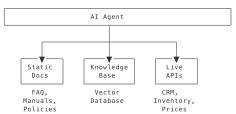

| | |
|--|--|
| **Duration** | 2.5 hours |
| **Day** | 6 of 7 |

## Learning Objectives

By the end of this module, students will be able to:

- Implement knowledge bases for voice agents
- Configure RAG (Retrieval-Augmented Generation)
- Build custom search indexes
- Integrate external knowledge sources

## Topics

### 1. Knowledge in Voice AI (25 min)

#### Why Knowledge Matters

Voice agents need access to accurate, up-to-date information:

| Without Knowledge | With Knowledge |
|-------------------|----------------|
| Generic responses | Accurate, specific answers |
| "I don't know" | Actual product details |
| Hallucinations | Factual information |
| Static information | Dynamic, current data |

#### Knowledge Sources



---

### 2. Built-in Search Skill (30 min)

#### Using the Search Skill

```python
from signalwire_agents import AgentBase


class KnowledgeAgent(AgentBase):
    def __init__(self):
        super().__init__(name="knowledge-agent")

        # Add search skill with configuration
        self.add_skill(
            "datasphere",
            {
                "document_id": "your-document-id",
                "count": 5,  # Number of results
                "distance": 0.7  # Similarity threshold
            }
        )

        self.prompt_add_section(
            "Role",
            "You are a knowledgeable assistant. Use the search skill "
            "to find accurate information before answering questions."
        )

        self.add_language("English", "en-US", "rime.spore")
```

#### Configuring Search Parameters

| Parameter | Description | Default |
|-----------|-------------|---------|
| `document_id` | ID of indexed document | Required |
| `count` | Max results to return | 5 |
| `distance` | Similarity threshold (0-1) | 0.6 |
| `tags` | Filter by document tags | None |

---

### 3. Building Search Indexes (35 min)

#### Using sw-search CLI

```bash
# Create index from markdown
sw-search index \
  --source ./docs/ \
  --output ./knowledge.index \
  --chunk-size 500

# Create index from website
sw-search crawl \
  --url https://docs.example.com \
  --depth 3 \
  --output ./docs.index

# Test search
sw-search query \
  --index ./knowledge.index \
  --query "How do I reset my password?"
```

#### Index Configuration

```yaml
# search_config.yaml
index:
  name: support-knowledge
  chunk_size: 500
  chunk_overlap: 50

sources:
  - type: directory
    path: ./docs
    patterns:
      - "*.md"
      - "*.txt"

  - type: url
    url: https://help.example.com
    depth: 2
    exclude:
      - "/admin/*"
      - "/login"

embedding:
  model: text-embedding-3-small
  dimensions: 1536
```

#### Loading Custom Index

```python
class CustomKBAgent(AgentBase):
    def __init__(self, kb_path: str):
        super().__init__(name="custom-kb-agent")

        # Load pre-built index
        self.add_skill(
            "search",
            {
                "index_path": kb_path,
                "count": 3
            }
        )
```

---

### 4. RAG Implementation Patterns (40 min)

#### Pattern 1: Simple RAG

Query knowledge base, include results in response:

```python
@agent.tool(
    description="Answer from knowledge base",
    parameters={
        "type": "object",
        "properties": {
            "question": {"type": "string", "description": "Question to answer"}
        },
        "required": ["question"]
    }
)
def answer_question(args: dict, raw_data: dict = None) -> SwaigFunctionResult:
    question = args.get("question", "")
    # Search knowledge base
    results = search_index.query(question, k=3)

    if not results:
        return SwaigFunctionResult(
            "I don't have information about that. "
            "Would you like me to connect you with support?"
        )

    # Format results for context
    context = "\n".join([r["content"] for r in results])

    return SwaigFunctionResult(
        f"Based on our documentation: {context}"
    )
```

#### Pattern 2: Contextual RAG

Include search results in system prompt:

```python
class ContextualRAGAgent(AgentBase):
    def __init__(self, kb_path: str):
        super().__init__(name="rag-agent")
        self.kb = load_knowledge_base(kb_path)

    def on_call_start(self, call_data: dict):
        """Hook called when call starts."""
        # Get caller context
        phone = call_data.get("from", "")

        # Pre-fetch relevant knowledge
        customer = self.lookup_customer(phone)
        if customer:
            relevant_docs = self.kb.query(
                f"customer tier {customer['tier']} policies",
                k=5
            )

            # Add to system prompt
            self.prompt_add_section(
                "Customer Context",
                f"Customer: {customer['name']}, Tier: {customer['tier']}"
            )

            self.prompt_add_section(
                "Relevant Policies",
                "\n".join([d["content"] for d in relevant_docs])
            )
```

#### Pattern 3: Hybrid Search

Combine semantic and keyword search:

```python
class HybridSearchAgent(AgentBase):
    def __init__(self):
        super().__init__(name="hybrid-agent")
        self._setup_functions()

    def _setup_functions(self):
        @self.tool(
            description="Search knowledge base",
            parameters={
                "type": "object",
                "properties": {
                    "query": {"type": "string", "description": "Search query"},
                    "category": {
                        "type": "string",
                        "description": "Category filter",
                        "enum": ["billing", "technical", "account"]
                    }
                },
                "required": ["query"]
            }
        )
        def search_kb(args: dict, raw_data: dict = None) -> SwaigFunctionResult:
            query = args.get("query", "")
            category = args.get("category")

            # Semantic search
            semantic_results = self.semantic_search(query, k=5)

            # Keyword search for specific terms
            if category:
                keyword_results = self.keyword_search(
                    query,
                    filters={"category": category},
                    k=3
                )
                # Merge results
                results = merge_results(semantic_results, keyword_results)
            else:
                results = semantic_results

            if not results:
                return SwaigFunctionResult(
                    "I couldn't find specific information on that topic."
                )

            # Return top result
            return SwaigFunctionResult(results[0]["content"])
```

---

### 5. Knowledge Base Best Practices (20 min)

#### Content Preparation

**Good Content Structure:**

```markdown
## Password Reset

### Overview
Users can reset their password through the account portal or mobile app.

### Steps
1. Go to account.example.com/reset
2. Enter your email address
3. Click the reset link in your email
4. Create a new password (8+ characters, 1 number)

### Common Issues

- Link expired: Request a new reset link
- Email not received: Check spam folder
- Still can't login: Contact support at 1-800-HELP

### Related Topics

- Account security
- Two-factor authentication
```

**Chunking Strategy:**

| Content Type | Chunk Size | Overlap |
|--------------|------------|---------|
| FAQ | 200 tokens | 20 |
| Documentation | 500 tokens | 50 |
| Long-form | 1000 tokens | 100 |

#### Index Maintenance

```python
class ManagedKnowledgeAgent(AgentBase):
    def __init__(self):
        super().__init__(name="managed-kb")
        self.last_index_update = None

    def refresh_index_if_needed(self):
        """Refresh index periodically."""
        if self.needs_refresh():
            self.rebuild_index()
            self.last_index_update = datetime.now()

    def needs_refresh(self) -> bool:
        if not self.last_index_update:
            return True
        age = datetime.now() - self.last_index_update
        return age > timedelta(hours=24)
```

---

### 6. External Knowledge Integration (30 min)

#### DataMap for Live Knowledge

```python
from signalwire_agents import DataMap, SwaigFunctionResult

# Product information from API
product_info = (
    DataMap("get_product_info")
    .description("Get product details")
    .parameter("sku", "string", "Product SKU", required=True)
    .webhook(
        "GET",
        "https://api.example.com/products/${enc:args.sku}",
        headers={"Authorization": "Bearer ${global_data.api_key}"}
    )
    .output(SwaigFunctionResult(
        "${response.name} costs $${response.price}. ${response.description}"
    ))
)

self.register_swaig_function(product_info.to_swaig_function())
```

#### Combining Static and Live Knowledge

```python
from signalwire_agents import AgentBase, DataMap, SwaigFunctionResult


class HybridKnowledgeAgent(AgentBase):
    def __init__(self):
        super().__init__(name="hybrid-knowledge")

        # Static knowledge via skill
        self.add_skill(
            "search",
            {"index_path": "./policies.index"}
        )

        # Live data via DataMap
        inventory = (
            DataMap("get_inventory")
            .description("Check real-time inventory")
            .parameter("sku", "string", "Product SKU", required=True)
            .webhook("GET", "https://api.example.com/inventory/${enc:args.sku}")
            .output(SwaigFunctionResult("We have ${response.quantity} in stock."))
        )
        self.register_swaig_function(inventory.to_swaig_function())

        self.prompt_add_section(
            "Knowledge Sources",
            bullets=[
                "Use search for policies, procedures, FAQs",
                "Use get_inventory for real-time stock levels",
                "If unsure, say so and offer to transfer to an expert"
            ]
        )
```

---

## Complete Example

{::nomarkdown}
<details>
<summary>Click to reveal complete solution</summary>
{:/}

```python
#!/usr/bin/env python3
"""Knowledge-enabled support agent."""

from signalwire_agents import AgentBase, DataMap, SwaigFunctionResult


class KnowledgeSupportAgent(AgentBase):
    def __init__(self, kb_path: str):
        super().__init__(name="knowledge-support")

        self.prompt_add_section(
            "Role",
            "You are a knowledgeable support agent. "
            "Always search the knowledge base before answering questions."
        )

        self.prompt_add_section(
            "Instructions",
            bullets=[
                "Search for relevant information first",
                "Cite sources when possible",
                "Admit when you don't know",
                "Offer to transfer for complex issues"
            ]
        )

        self.add_language("English", "en-US", "rime.spore")

        # Add search skill
        self.add_skill(
            "search",
            {
                "index_path": kb_path,
                "count": 3,
                "distance": 0.7
            }
        )

        # Add live data
        self._setup_live_data()

    def _setup_live_data(self):
        order_status = (
            DataMap("check_order_status")
            .description("Check order status")
            .parameter("order_id", "string", "Order ID", required=True)
            .webhook("GET", "https://api.example.com/orders/${enc:args.order_id}")
            .output(SwaigFunctionResult(
                "Order ${response.order_id}: ${response.status}. ${response.details}"
            ))
            .fallback_output(SwaigFunctionResult(
                "I couldn't find that order. Please verify the order number."
            ))
        )
        self.register_swaig_function(order_status.to_swaig_function())


if __name__ == "__main__":
    agent = KnowledgeSupportAgent(kb_path="./support_kb.index")
    agent.run()
```

{::nomarkdown}
</details>
{:/}

---

## Key Takeaways

1. **Knowledge enables accuracy** - Ground responses in facts
2. **Index your content** - Structured search beats guessing
3. **Combine sources** - Static docs + live APIs
4. **Maintain freshness** - Keep indexes updated
5. **Handle unknowns gracefully** - Admit limits, offer alternatives

## Preparation for Lab 3.2

- Gather documentation for your domain
- Identify live data sources
- Plan knowledge organization

## Lab Preview

In Lab 3.2, you will:

1. Build a knowledge index from documentation
2. Configure RAG for your agent
3. Add live data integration
4. Test knowledge retrieval accuracy
