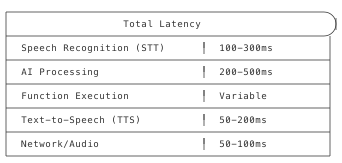

| | |
|--|--|
| **Duration** | 2 hours |
| **Day** | 6 of 7 |

## Learning Objectives

By the end of this module, students will be able to:

- Optimize agent response times
- Configure speech and timing parameters
- Reduce latency in function calls
- Profile and benchmark agent performance

## Topics

### 1. Voice AI Performance Factors (20 min)

#### The Latency Stack



#### Performance Goals

| Metric | Good | Acceptable | Poor |
|--------|------|------------|------|
| First response | <1s | 1-2s | >2s |
| Function response | <500ms | 500ms-1s | >1s |
| Total turn latency | <2s | 2-3s | >3s |

---

### 2. Speech Timing Configuration (30 min)

#### Attention Timeout

How long to wait for user to start speaking:

```python
agent.set_params({
    "attention_timeout": 10000,  # 10 seconds
    "attention_timeout_prompt": "Are you still there?"
})
```

#### End of Speech Detection

Balance between responsiveness and interruption:

```python
agent.set_params({
    # Time to wait after user stops speaking
    "end_of_speech_timeout": 500,  # 500ms default

    # Barge-in settings (barge is enabled by default)
    "barge_min_words": 2  # Require 2 words to interrupt
})
```

#### Speed Control

```python
agent.set_params({
    "speech_rate": 1.0,  # 1.0 = normal, 1.2 = faster
    "ai_volume": 1.0     # Volume level
})
```

#### Timing Comparison

| Setting | Use Case |
|---------|----------|
| Short timeout (300ms) | Quick transactions, confirmations |
| Medium timeout (500ms) | Normal conversation |
| Long timeout (800ms) | Thoughtful answers, elderly callers |

---

### 3. Function Performance (35 min)

#### Fillers for Long Operations

Keep the caller engaged during processing:

```python
@agent.tool(
    description="Search inventory",
    parameters={
        "type": "object",
        "properties": {
            "query": {"type": "string", "description": "Search query"}
        },
        "required": ["query"]
    },
    fillers=[
        "Let me check on that...",
        "One moment while I search...",
        "Still looking..."
    ]
)
def search_inventory(args: dict, raw_data: dict = None) -> SwaigFunctionResult:
    query = args.get("query", "")
    # Long operation
    results = database.search(query)
    return SwaigFunctionResult(f"Found {len(results)} items.")
```

#### Timeout Handling

```python
import requests
from requests.exceptions import Timeout

@agent.tool(
    description="Get order status",
    parameters={
        "type": "object",
        "properties": {
            "order_id": {"type": "string", "description": "Order ID"}
        },
        "required": ["order_id"]
    }
)
def get_order(args: dict, raw_data: dict = None) -> SwaigFunctionResult:
    order_id = args.get("order_id", "")
    try:
        response = requests.get(
            f"https://api.example.com/orders/{order_id}",
            timeout=3  # 3 second max
        )
        return SwaigFunctionResult(f"Order status: {response.json()['status']}")

    except Timeout:
        return SwaigFunctionResult(
            "I'm having trouble reaching our order system. "
            "Can I take your number and call you back?"
        )
```

#### Async Patterns

```python
import asyncio
import aiohttp

class AsyncAgent(AgentBase):
    def __init__(self):
        super().__init__(name="async-agent")
        self._setup_functions()

    def _setup_functions(self):
        @self.tool(
            description="Check multiple systems",
            parameters={
                "type": "object",
                "properties": {},
                "required": []
            },
            fillers=["Checking all systems..."]
        )
        async def check_all_systems(args: dict, raw_data: dict = None) -> SwaigFunctionResult:
            async with aiohttp.ClientSession() as session:
                # Parallel requests
                tasks = [
                    self.check_system(session, "inventory"),
                    self.check_system(session, "shipping"),
                    self.check_system(session, "billing")
                ]
                results = await asyncio.gather(*tasks, return_exceptions=True)

            # Summarize results
            statuses = [r for r in results if not isinstance(r, Exception)]
            return SwaigFunctionResult(f"Systems checked: {len(statuses)} operational")

        async def check_system(self, session, system):
            async with session.get(f"https://api.example.com/{system}/health") as resp:
                return await resp.json()
```

#### Caching Strategies

```python
from functools import lru_cache
from datetime import datetime, timedelta


class CachedAgent(AgentBase):
    def __init__(self):
        super().__init__(name="cached-agent")
        self._cache = {}
        self._cache_ttl = timedelta(minutes=5)

    def _get_cached(self, key: str):
        if key in self._cache:
            value, timestamp = self._cache[key]
            if datetime.now() - timestamp < self._cache_ttl:
                return value
        return None

    def _set_cached(self, key: str, value):
        self._cache[key] = (value, datetime.now())

    @AgentBase.tool(
        description="Get product pricing",
        parameters={
            "type": "object",
            "properties": {
                "product_id": {"type": "string", "description": "Product ID"}
            },
            "required": ["product_id"]
        }
    )
    def get_pricing(self, args: dict, raw_data: dict = None) -> SwaigFunctionResult:
        product_id = args.get("product_id", "")
        # Check cache first
        cached = self._get_cached(f"price:{product_id}")
        if cached:
            return SwaigFunctionResult(f"Price: ${cached}")

        # Fetch and cache
        price = self.fetch_price(product_id)
        self._set_cached(f"price:{product_id}", price)

        return SwaigFunctionResult(f"Price: ${price}")
```

---

### 4. Prompt Optimization (25 min)

#### Concise Prompts

```python
# BAD: Too verbose
self.prompt_add_section(
    "Role",
    "You are a highly skilled and knowledgeable customer service "
    "representative working for our esteemed company. Your primary "
    "responsibility is to assist customers with their inquiries in "
    "a professional, courteous, and efficient manner while maintaining "
    "the highest standards of service excellence..."
)

# GOOD: Clear and concise
self.prompt_add_section(
    "Role",
    "Customer service agent for TechCorp. Help with orders, "
    "returns, and product questions."
)
```

#### Structured Instructions

```python
# Use bullets for clarity
self.prompt_add_section(
    "Response Guidelines",
    bullets=[
        "Keep answers under 2 sentences when possible",
        "Confirm understanding before taking action",
        "Offer alternatives if request can't be fulfilled"
    ]
)
```

#### Focused Context

```python
# Only include relevant information
class FocusedAgent(AgentBase):
    def __init__(self, department: str):
        super().__init__(name=f"{department}-agent")

        # Department-specific prompt only
        if department == "sales":
            self._setup_sales_prompt()
        elif department == "support":
            self._setup_support_prompt()

    def _setup_sales_prompt(self):
        self.prompt_add_section(
            "Role",
            "Sales agent. Help with pricing and purchases."
        )
        # Only sales-relevant info

    def _setup_support_prompt(self):
        self.prompt_add_section(
            "Role",
            "Support agent. Troubleshoot issues."
        )
        # Only support-relevant info
```

---

### 5. Profiling and Benchmarking (30 min)

#### Measuring Performance

```python
import time
import logging

logger = logging.getLogger(__name__)


class ProfiledAgent(AgentBase):
    def __init__(self):
        super().__init__(name="profiled-agent")
        self._setup_functions()

    def _setup_functions(self):
        @self.tool(
            description="Profiled function",
            parameters={
                "type": "object",
                "properties": {
                    "query": {"type": "string", "description": "Query to process"}
                },
                "required": ["query"]
            }
        )
        def my_function(args: dict, raw_data: dict = None) -> SwaigFunctionResult:
            query = args.get("query", "")
            start = time.perf_counter()

            # Your logic here
            result = process_query(query)

            elapsed = time.perf_counter() - start
            logger.info(f"my_function took {elapsed:.3f}s")

            return SwaigFunctionResult(result)
```

#### Performance Decorator

```python
import functools
import time
import logging

logger = logging.getLogger(__name__)


def profile(func):
    """Decorator to profile function execution time."""
    @functools.wraps(func)
    def wrapper(*args, **kwargs):
        start = time.perf_counter()
        result = func(*args, **kwargs)
        elapsed = time.perf_counter() - start
        logger.info(f"{func.__name__}: {elapsed:.3f}s")
        return result
    return wrapper


class OptimizedAgent(AgentBase):
    @profile
    def _process_order(self, order_id: str):
        # Implementation
        pass
```

#### Load Testing

```bash
# Using hey for HTTP load testing
hey -n 100 -c 10 \
  -m POST \
  -H "Content-Type: application/json" \
  -d '{}' \
  http://localhost:3000/agent

# Using locust for complex scenarios
# locustfile.py
from locust import HttpUser, task, between

class AgentUser(HttpUser):
    wait_time = between(1, 3)

    @task
    def call_agent(self):
        self.client.post("/agent", json={})

    @task
    def call_function(self):
        self.client.post("/agent/swaig", json={
            "function": "get_status",
            "args": {}
        })
```

#### Performance Dashboard

```python
from datetime import datetime
from collections import defaultdict


class MetricsAgent(AgentBase):
    def __init__(self):
        super().__init__(name="metrics-agent")
        self.metrics = defaultdict(list)

    def record_metric(self, name: str, value: float):
        self.metrics[name].append({
            "value": value,
            "timestamp": datetime.now().isoformat()
        })

    def get_metrics_summary(self):
        summary = {}
        for name, values in self.metrics.items():
            vals = [v["value"] for v in values]
            summary[name] = {
                "count": len(vals),
                "avg": sum(vals) / len(vals) if vals else 0,
                "min": min(vals) if vals else 0,
                "max": max(vals) if vals else 0
            }
        return summary
```

---

## Performance Optimization Checklist

### Speech Settings

- [ ] Appropriate attention timeout
- [ ] End-of-speech timeout tuned
- [ ] Barge-in configured if needed

### Function Performance

- [ ] Timeouts on all external calls
- [ ] Fillers for slow operations
- [ ] Caching where appropriate
- [ ] Async for parallel operations

### Prompts

- [ ] Concise system prompt
- [ ] Only necessary context included
- [ ] Clear, structured instructions

### Monitoring

- [ ] Performance logging enabled
- [ ] Key metrics tracked
- [ ] Alerts for degradation

---

## Key Takeaways

1. **Latency is cumulative** - Every millisecond counts
2. **Use fillers** - Keep users engaged during processing
3. **Timeout everything** - Never block indefinitely
4. **Cache wisely** - Fresh data vs. speed tradeoff
5. **Measure constantly** - Can't improve what you don't measure

## Preparation for Lab 3.3

- Identify slow functions in your agents
- Gather baseline performance metrics
- List external dependencies

## Lab Preview

In Lab 3.3, you will:

1. Profile an existing agent
2. Implement caching and timeouts
3. Configure optimal speech settings
4. Measure improvement with load testing

---

**Next:** [Module 3.4 - Security and Compliance](m3.4-security-compliance)
